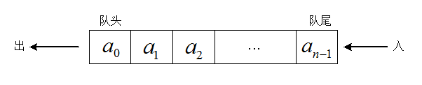

## 【任务2 - 栈、队列、递归】

首先回顾一下数组，数组更多的是用来进行数据的存储，纯粹用来存储数据的数据结构，我们期望数组的插入、删除和查找性能都比较好。对于无序数组，插入快，但是删除和查找都很慢。

栈和队列更多是作为程序员构思算法的辅助工具，而非完全的数据存储工具。这些数据结构的生命周期比数据库类型的结构要短得多，在程序执行期间它们才被创建，通常用它们去执行某项特殊的业务，执行完成之后，它们就被销毁。

### 栈

**栈的基本概念**

栈（英语：stack）又称为堆栈或堆叠，栈作为一种数据结构，是一种只能在一端(称为栈顶(top))进行插入和删除操作的特殊线性表。它按照先进后出的原则存储数据，先进入的数据被压入栈底，最后的数据在栈顶，需要读数据的时候从栈顶开始弹出数据（最后一个数据被第一个读出来）。栈具有记忆作用，对栈的插入与删除操作中，不需要改变栈底指针。

栈是允许在同一端进行插入和删除操作的特殊线性表。允许进行插入和删除操作的一端称为栈顶(top)，另一端为栈底(bottom)；栈底固定，而栈顶浮动；栈中元素个数为零时称为空栈。插入一般称为进栈（PUSH），删除则称为退栈（POP）。

由于堆叠数据结构只允许在一端进行操作，因而按照后进先出（LIFO, Last In First Out）的原理运作。栈也称为后进先出表。

这里以羽毛球筒为例，羽毛球筒就是一个栈，刚开始羽毛球筒是空的，也就是空栈，然后我们一个一个放入羽毛球，也就是一个一个push进栈，当我们需要使用羽毛球的时候，从筒里面拿，也就是pop出栈，但是第一个拿到的羽毛球是我们最后放进去的。

#### 用数组实现一个顺序栈

```
package com.ys.datastructure;

public class MyStack {
	private int[] array;
	private int maxSize;
	private int top;

	public MyStack(int size) {
		this.maxSize = size;
		array = new int[size];
		top = -1;
	}

	// 压入数据
	public void push(int value) {
		if (top < maxSize - 1) {
			array[++top] = value;
		}
	}

	// 弹出栈顶数据
	public int pop() {
		return array[top--];
	}

	// 访问栈顶数据
	public int peek() {
		return array[top];
	}

	// 判断栈是否为空
	public boolean isEmpty() {
		return (top == -1);
	}

	// 判断栈是否满了
	public boolean isFull() {
		return (top == maxSize - 1);
	}

}
```

测试：

```
package com.ys.test;

import com.ys.datastructure.MyStack;

public class MyStackTest {
	public static void main(String[] args) {
		MyStack stack = new MyStack(3);
		stack.push(1);
		stack.push(2);
		stack.push(3);
		System.out.println(stack.peek());
		while (!stack.isEmpty()) {
			System.out.println(stack.pop());
		}
	}
}
```

结果：

```
3
3
2
1
```

这个栈是用数组实现的，内部定义了一个数组，一个表示最大容量的值以及一个指向栈顶元素的top变量。构造方法根据参数规定的容量创建一个新栈，push()方法是向栈中压入元素，指向栈顶的变量top加一，使它指向原顶端数据项上面的一个位置，并在这个位置上存储一个数据。pop()方法返回top变量指向的元素，然后将top变量减一，便移除了数据项。要知道 top 变量指向的始终是栈顶的元素。

**产生的问题：**

* 上面栈的实现初始化容量之后，后面是不能进行扩容的（虽然栈不是用来存储大量数据的），如果说后期数据量超过初始容量之后怎么办？（自动扩容）
* 我们是用数组实现栈，在定义数组类型的时候，也就规定了存储在栈中的数据类型，那么同一个栈能不能存储不同类型的数据呢？（声明为Object）
* 栈需要初始化容量，而且数组实现的栈元素都是连续存储的，那么能不能不初始化容量呢？（改为由链表实现）

#### 用链表实现一个链式栈
对于上面出现的问题，第一个能自动扩容，第二个能存储各种不同类型的数据，解决办法如下：（第三个在讲链表的时候在介绍）

这个模拟的栈在JDK源码中，大家可以参考 Stack 类的实现。

```
public
class Stack<E> extends Vector<E>
```

demo:
```
package com.ys.datastructure;

import java.util.Arrays;
import java.util.EmptyStackException;

public class ArrayStack {
	// 存储元素的数组,声明为Object类型能存储任意类型的数据
	private Object[] elementData;
	// 指向栈顶的指针
	private int top;
	// 栈的总容量
	private int size;

	// 默认构造一个容量为10的栈
	public ArrayStack() {
		this.elementData = new Object[10];
		this.top = -1;
		this.size = 10;
	}

	public ArrayStack(int initialCapacity) {
		if (initialCapacity < 0) {
			throw new IllegalArgumentException("栈初始容量不能小于0: " + initialCapacity);
		}
		this.elementData = new Object[initialCapacity];
		this.top = -1;
		this.size = initialCapacity;
	}

	// 压入元素
	public Object push(Object item) {
		// 是否需要扩容
		isGrow(top + 1);
		elementData[++top] = item;
		return item;
	}

	// 弹出栈顶元素
	public Object pop() {
		Object obj = peek();
		remove(top);
		return obj;
	}

	// 获取栈顶元素
	public Object peek() {
		if (top == -1) {
			throw new EmptyStackException();
		}
		return elementData[top];
	}

	// 判断栈是否为空
	public boolean isEmpty() {
		return (top == -1);
	}

	// 删除栈顶元素
	public void remove(int top) {
		// 栈顶元素置为null
		elementData[top] = null;
		this.top--;
	}

	/**
	 * 是否需要扩容，如果需要，则扩大一倍并返回true，不需要则返回false
	 * 
	 * @param minCapacity
	 * @return
	 */
	public boolean isGrow(int minCapacity) {
		int oldCapacity = size;
		// 如果当前元素压入栈之后总容量大于前面定义的容量，则需要扩容
		if (minCapacity >= oldCapacity) {
			// 定义扩大之后栈的总容量
			int newCapacity = 0;
			// 栈容量扩大两倍(左移一位)看是否超过int类型所表示的最大范围
			if ((oldCapacity << 1) - Integer.MAX_VALUE > 0) {
				newCapacity = Integer.MAX_VALUE;
			} else {
				newCapacity = (oldCapacity << 1);// 左移一位，相当于*2
			}
			this.size = newCapacity;
			int[] newArray = new int[size];
			elementData = Arrays.copyOf(elementData, size);
			return true;
		} else {
			return false;
		}
	}
}
```

测试：
```
//测试自定义栈类 ArrayStack
//创建容量为3的栈，然后添加4个元素，3个int，1个String.
@Test
public void testArrayStack(){
	 ArrayStack stack = new ArrayStack(3);
	 stack.push(1);
	 //System.out.println(stack.peek());
	 stack.push(2);
	 stack.push(3);
	 stack.push("abc");
	 System.out.println(stack.peek());
	 stack.pop();
	 stack.pop();
	 stack.pop();
	 System.out.println(stack.peek());
}
```

结果：

```
abc
1
```

#### 编程模拟实现一个浏览器的前进、后退功能

**整体思路**

用两个栈来实现。

一个栈用来做页面前面的保存，一个栈做退出的保存页面链接。

比如从a ->b ->c 那么栈就存储了a,b,c 元素 。倒退那么就把c放到第二个栈中。c,b,a。这样就保存了下来这些链接内容，知道怎么前进与退出了

#### 栈总结

栈通过提供限制性的访问方法push()和pop()，使得程序不容易出错。

对于栈的实现，我们稍微分析就知道，数据入栈和出栈的时间复杂度都为O(1)，也就是说栈操作所耗的时间不依赖栈中数据项的个数，因此操作时间很短。而且需要注意的是栈不需要比较和移动操作，我们不要画蛇添足。

#### 参考

[08 | 栈：如何实现浏览器的前进和后退功能？](https://xintiaohuiyi.gitbook.io/jynotebook/shu-ji/shu-ju-jie-gou-yu-suan-fa-zhi-mei/08-zhan-ff1a-ru-he-shi-xian-liu-lan-qi-de-qian-jin-he-hou-tui-gong-neng-ff1f)

[算法笔记：栈，实现浏览器的前进与后退功能](https://www.jianshu.com/p/6e9205cfcadf)

[数据结构和算法（四）：栈](https://zhuanlan.zhihu.com/p/37467342)

### 队列

**概念**

队列（简称作队，Queue）也是一种特殊的线性表，队列的数据元素以及数据元素间的逻辑关系和线性表完全相同，其差别是线性表允许在任意位置插入和删除，而队列只允许在其一端进行插入操作在其另一端进行删除操作。

队列中允许进行插入操作的一端称为队尾，允许进行删除操作的一端称为队头。队列的插入操作通常称作入队列，队列的删除操作通常称作出队列。

下图是一个依次向队列中插入数据元素a0,a1,...,an-1后的示意图：



上图中，a0是当前 队头数据元素，an-1是当前 队尾数据元素。

为了避免当只有一个元素时，对头和队尾重合使得处理变得麻烦，所以引入两个指针：front指针指向队头元素，rear指针指向队尾元素的下一个位置，这样的话，当front指针等于rear时，此队列不是还剩一个元素，而是空队列。

**队列的抽象数据类型**

**数据集合：**

队列的数据集合可以表示为a0,a1,…,an-1，每个数据元素的数据类型可以是任意的类型。

**操作集合：**

1. 入队列append(obj)：把数据元素obj插入队尾。
2. 出队列delete()：把队头数据元素删除并由函数返回。
3. 取队头数据元素getFront()：取队头数据元素并由函数返回。
4. 非空否isEmpty()：非空否。若队列非空，则函数返回false，否则函数返回true。

#### 用数组实现一个顺序队列

```
public class ArrayQueue <T>
{
    private T[] queue;//队列数组
    private int head=0;//头下标
    private int tail=0;//尾下标
    private int count=0;//元素个数
    public ArrayQueue()
    {
        queue=(T[])new Object[10];
        this.head=0;//头下标为零
        this.tail=0;
        this.count=0;
    }
    public ArrayQueue(int size)
    {
        queue=(T[])new Object[size];
        this.head=0;
        this.tail=0;
        this.count=0;
    }
    //入队
    public boolean inQueue(T t)
    {
        if(count==queue.length)
            return false;
        queue[tail++%(queue.length)]=t;//如果不为空就放入下一个
        count++;
        return true;
    }
    //出队
    public T outQueue()
    {
        if(count==0)//如果是空的那就不能再出栈了
            return null;
        count--;
        return queue[head++%(queue.length)];
    }
    //查队头
    public T showHead()
    {
        if(count==0) return null;
        return queue[head];
    }
    //判满
    public boolean isFull()
    {
        return count==queue.length;
    }
    //判空
    public boolean isEmpty()
    {
        return count==0;
    }
    //
} 
```

测试：

```
public class ArrayQueueTest {
	public static void main(String[] args) {
		ArrayQueue<Integer> arrayQueue=new ArrayQueue<Integer>(10);
		System.out.println("队空？"+arrayQueue.isEmpty());
//		for(int i=0;!arrayQueue.isFull();i++)
//		{
//			arrayQueue.inQueue(i);
//		}
		for(int i=0;i<=10;i++)
		{
			System.out.println(arrayQueue.inQueue(i));
		}
		System.out.println("队满？"+arrayQueue.isFull());
		for(int i=0;!arrayQueue.isEmpty();i++)
		{
			System.out.println(arrayQueue.showHead()+"  "+arrayQueue.outQueue());
		}
	}
}
```

结果：

```
队空？true
队满？true
0  0
1  1
2  2
3  3
4  4
5  5
6  6
7  7
8  8
9  9
```

#### 用链表实现一个链式队列

```
package lang;
 
import java.io.Serializable;
 
/**
 * @ClassName: LinkQueue
 * @Description:  链式队列
 * @date 2019年3月04日
 * @param <T>
 */
public class LinkQueue<T> implements Serializable{
  /**
   * @Fields serialVersionUID : TODO
   */
  private static final long serialVersionUID = -6726728595616312615L;
 
  //定义一个内部类Node，Node实例代表链队列的节点。
  private class Node {
    
    private T data;//保存节点的数据
   
    private Node next;//指向下个节点的引用
 
    //无参数的构造器
    public Node() {
    }
 
    //初始化全部属性的构造器
    public Node(T data, Node next) {
      this.data = data;
      this.next = next;
    }
  }
  
  private Node front;//保存该链队列的头节点
  
  private Node rear;//保存该链队列的尾节点
 
  private int size;//保存该链队列中已包含的节点数
 
  /**
   * <p>Title: LinkQueue </p>     
   * <p>Description: 创建空链队列 </p> 
   */
  public LinkQueue() {
    //空链队列，front和rear都是null
    front = null;
    rear = null;
  }
 
  /**
   * <p>Title: LinkQueue </p>    
   * <p>Description: 以指定数据元素来创建链队列，该链队列只有一个元素</p> 
   */
  public LinkQueue(T element) {
    front = new Node(element, null);
    //只有一个节点，front、rear都指向该节点
    rear = front;
    size++;
  }
 
  /**
   * @Title: size     
   * @Description: 获取顺序队列的大小    
   * @return
   */
  public int size() {
    return size;
  }
 
  /**
   * @Title: offer     
   * @Description: 入队    
   * @param element
   */
  public void offer(T element) {
    //如果该链队列还是空链队列
    if (front == null) {
      front = new Node(element, null);     
      rear = front;//只有一个节点，front、rear都指向该节点
    } else {     
      Node newNode = new Node(element, null);//创建新节点     
      rear.next = newNode;//让尾节点的next指向新增的节点     
      rear = newNode;//以新节点作为新的尾节点
    }
    size++;
  }
 
  /**
   * @Title: poll     
   * @Description: 出队    
   * @return
   */
  public T poll() {
    Node oldFront = front;
    front = front.next;
    oldFront.next = null;
    size--;
    return oldFront.data;
  }
 
  /**
   * @Title: peek     
   * @Description: 返回队列顶元素，但不删除队列顶元素    
   * @return
   */
  public T peek() {
    return rear.data;
  }
 
  /**
   * @Title: isEmpty     
   * @Description: 判断顺序队列是否为空队列    
   * @return
   */
  public boolean isEmpty() {
    return size == 0;
  }
 
  /**
   * @Title: clear     
   * @Description: 清空顺序队列
   */
  public void clear() {
    //将front、rear两个节点赋为null
    front = null;
    rear = null;
    size = 0;
  }
 
  public String toString() {
    //链队列为空链队列时
    if (isEmpty()) {
      return "[]";
    } else {
      StringBuilder sb = new StringBuilder("[");
      for (Node current = front; current != null; current = current.next) {
        sb.append(current.data.toString() + ", ");
      }
      int len = sb.length();
      return sb.delete(len - 2, len).append("]").toString();
    }
  }
 
  public static void main(String[] args) {
    LinkQueue<String> queue = new LinkQueue<String>("aaaa");
    //添加两个元素
    queue.offer("bbbb");
    queue.offer("cccc");
    System.out.println(queue);
    //删除一个元素后
    queue.poll();
    System.out.println("删除一个元素后的队列：" + queue);
    //再次添加一个元素
    queue.offer("dddd");
    System.out.println("再次添加元素后的队列：" + queue);
    //删除一个元素后，队列可以再多加一个元素
    queue.poll();
    //再次加入一个元素
    queue.offer("eeee");
    System.out.println(queue);
  }
}
```

#### 实现一个循环队列

```
package lang;
 
import java.io.Serializable;
import java.util.Arrays;
 
/**
 * @ClassName: LoopQueue
 * @Description: 循环队列
 * @date 2014年1月20日 下午3:47:14
 */
public class LoopQueue<T> implements Serializable{
  /**
   * @Fields serialVersionUID : TODO
   */
  private static final long serialVersionUID = -3670496550272478781L;
 
  private int DEFAULT_SIZE = 10;
 
  private int capacity;//保存数组的长度
 
  private Object[] elementData;//定义一个数组用于保存循环队列的元素
 
  private int front = 0;//队头
 
  private int rear = 0;//队尾
 
  //以默认数组长度创建空循环队列
  public LoopQueue() {
    capacity = DEFAULT_SIZE;
    elementData = new Object[capacity];
  }
 
  //以一个初始化元素来创建循环队列
  public LoopQueue(T element) {
    this();
    elementData[0] = element;
    rear++;
  }
 
  /**
   * 以指定长度的数组来创建循环队列
   * @param element 指定循环队列中第一个元素
   * @param initSize 指定循环队列底层数组的长度
   */
  public LoopQueue(T element, int initSize) {
    this.capacity = initSize;
    elementData = new Object[capacity];
    elementData[0] = element;
    rear++;
  }
 
  //获取循环队列的大小
  public int size() {
    if (isEmpty()) {
      return 0;
    }
    return rear > front ? rear - front : capacity - (front - rear);
  }
 
  //插入队列
  public void add(T element) {
    if (rear == front && elementData[front] != null) {
      throw new IndexOutOfBoundsException("队列已满的异常");
    }
    elementData[rear++] = element;
    //如果rear已经到头，那就转头
    rear = rear == capacity ? 0 : rear;
  }
 
  //移除队列
  public T remove() {
    if (isEmpty()) {
      throw new IndexOutOfBoundsException("空队列异常");
    }
    //保留队列的rear端的元素的值
    T oldValue = (T) elementData[front];
    //释放队列的rear端的元素
    elementData[front++] = null;
    //如果front已经到头，那就转头
    front = front == capacity ? 0 : front;
    return oldValue;
  }
 
  //返回队列顶元素，但不删除队列顶元素
  public T element() {
    if (isEmpty()) {
      throw new IndexOutOfBoundsException("空队列异常");
    }
    return (T) elementData[front];
  }
 
  //判断循环队列是否为空队列
  public boolean isEmpty() {
    //rear==front且rear处的元素为null
    return rear == front && elementData[rear] == null;
  }
 
  //清空循环队列
  public void clear() {
    //将底层数组所有元素赋为null
    Arrays.fill(elementData, null);
    front = 0;
    rear = 0;
  }
 
  public String toString() {
    if (isEmpty()) {
      return "[]";
    } else {
      //如果front < rear，有效元素就是front到rear之间的元素
      if (front < rear) {
        StringBuilder sb = new StringBuilder("[");
        for (int i = front; i < rear; i++) {
          sb.append(elementData[i].toString() + ", ");
        }
        int len = sb.length();
        return sb.delete(len - 2, len).append("]").toString();
      }
      //如果front >= rear，有效元素为front->capacity之间、0->front之间的
      else {
        StringBuilder sb = new StringBuilder("[");
        for (int i = front; i < capacity; i++) {
          sb.append(elementData[i].toString() + ", ");
        }
        for (int i = 0; i < rear; i++) {
          sb.append(elementData[i].toString() + ", ");
        }
        int len = sb.length();
        return sb.delete(len - 2, len).append("]").toString();
      }
    }
  }
 
  public static void main(String[] args) {
    LoopQueue<String> queue = new LoopQueue<String>("aaaa", 3);
    //添加两个元素
    queue.add("bbbb");
    queue.add("cccc");
    //此时队列已满
    System.out.println(queue);
    //删除一个元素后，队列可以再多加一个元素
    queue.remove();
    System.out.println("删除一个元素后的队列：" + queue);
    //再次添加一个元素，此时队列又满
    queue.add("dddd");
    System.out.println(queue);
    System.out.println("队列满时的长度：" + queue.size());
    //删除一个元素后，队列可以再多加一个元素
    queue.remove();
    //再次加入一个元素，此时队列又满
    queue.add("eeee");
    System.out.println(queue);
  }
}
```

#### 参考

[java 用数组实现队列](https://blog.csdn.net/qq_21808961/article/details/76239094)

[数据结构Java实现07----队列：顺序队列&顺序循环队列、链式队列、顺序优先队列](https://www.cnblogs.com/qianguyihao/p/4793339.html)

[java队列实现（顺序队列、链式队列、循环队列）](https://blog.csdn.net/jiutianhe/article/details/18606295)

### 递归

#### 编程实现斐波那契数列求值 f(n)=f(n-1)+f(n-2)

#### 编程实现求阶乘 n!

#### 编程实现一组数据集合的全排列