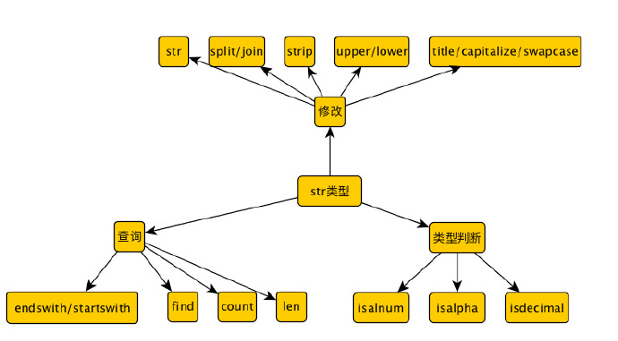

#### 【python基础】-Task2-队列、元组
序列是Python中最基本的数据结构。

Python有6个序列的内置类型，但最常见的是列表和元组。

序列都可以进行的操作包括索引，切片,加，乘，检查成员。

此外，Python已经内置确定序列的长度以及确定最大和最小的元素的方法。

##### 1.列表
列表是最常用的Python数据类型，形式：方括号内的逗号分割值列表。

列表的数据项不需要具有相同的类型

列表的特点：

1. 是一个有序集合
2. 通过下标来索引，读取数据
3. 支持嵌套
4. 是一个可变的类型

创建一个列表，只要把逗号分隔的不同的数据项使用方括号括起来即可。如下所示：
```python
list1 = ['Google','Runoob',1007,2000];
list2 = [1,2,3,4,5];
list3 = ["a","b","c","d"];
```
与字符串索引一样，列表索引从0开始。列表可以进行截取、组合等。

* 索引
序列中的每个元素都分配一个数字-它的位置，或索引，第一个索引是0，第二个索引是1，依次类推。
* 基本操作(创建,`append()`,`pop()`,`del()`,拷贝)
```python
# 定义一个姓名列表
names = ["Zhangsan","Lisi","Wangwu"]
# 输出列表中每个项的值
print(names[0])
print(names[1])
print(names[2])
```
运行结果：
```
Zhangsan
Lisi
Wangwu
```
以上是利用下标输出列表的值。

###### 列表长度-len()函数
java中数组是有长度的，python中的列表也是有长度的，我们通过len(list)就可以获取列表的长度。【**由于python中的for循环的特殊性，不需要拿到长度照样可以遍历**】

* for循环遍历
```python
# 遍历输出姓名列表
names = ["Zhangsan","Lisi","Wangwu"]
print("列表的长度是：%d",len(names))
# 遍历输出
for name in names:
    print(name)
```
输出结果：
```
列表的长度是：3
Zhangsan
Lisi
Wangwu
```
* while循环
```python
# while 利用len()函数遍历列表
names = ["Zhangsan","Lisi","Wangwu"]
size = len(names)
i = 0
while i < size:
    print(names[i])
    i+=1
```
输出结果:
```
Zhangsan
Lisi
Wangwu
```
###### append函数
`list.append(obj)`在列表的末尾添加新的对象。

```python
# 在已有列表中添加Zhaoliu
names = ["Zhangsan","Lisi","Wangwu"]
print("append前的列表：%s"%names)
names.append("Zhaoliu")
print("append后的列表：%s"%names)
```
输出结果:
```
append前的列表：['Zhangsan', 'Lisi', 'Wangwu']
append后的列表：['Zhangsan', 'Lisi', 'Wangwu', 'Zhaoliu']
```
###### extend
`list.extend(seq):`将另一个列表一次性追加到列表的末尾。
```python
names1 = ["Zhangsan","Lisi","Wangwu"]
names2 = ["Zhaoliu","Haoqi"]
print("1班同学们:%s"%names1)
print("2班同学们:%s"%names2)
names1.extend(names2)
print("extend 之后合成一个班:%s"%names1)
```
输出结果：
```
1班同学们:['Zhangsan', 'Lisi', 'Wangwu']
2班同学们:['Zhaoliu', 'Haoqi']
extend 之后合成一个班:['Zhangsan', 'Lisi', 'Wangwu', 'Zhaoliu', 'Haoqi']
```

###### sort和reverse
`sort([func])`:func是可选参数，如果设置了就按该参数的方法进行排序，否则就按默认的顺序进行排序：**从小到大**
```python
# 把全班同学的成绩按照从小到大的顺序排列出来，并找出80以上的成绩
scores = [60,54,80,99,45,79,26,72,76,75,88,89,95]
# 定义一个空列表用于存放大于80分的成绩
youxiu = []
print("未排序之前的成绩:%s"%scores)
scores.sort()
print("从小到大排序之后的成绩:%s"%scores)
for score in scores:
    if(score >= 80):
        youxiu.append(score)
print("全班达到80分以上的成绩共有%d个%s"%(len(youxiu),youxiu))
```
输出结果：
```
未排序之前的成绩:[60, 54, 80, 99, 45, 79, 26, 72, 76, 75, 88, 89, 95]
从小大大排序之后的成绩:[26, 45, 54, 60, 72, 75, 76, 79, 80, 88, 89, 95, 99]
全班达到80分以上的成绩共有5个[80, 88, 89, 95, 99]
```
```python
# 全班成绩从大到小排序。
scores = [60,54,80,99,45,79,26,72,76,75,88,89,95]
print("未排序之前的成绩:%s"%scores)
scores.sort(reverse=True)
print("从大到小排序之后的成绩:%s"%scores)
```
输出结果：
```
未排序之前的成绩:[60, 54, 80, 99, 45, 79, 26, 72, 76, 75, 88, 89, 95]
从大到小排序之后的成绩:[99, 95, 89, 88, 80, 79, 76, 75, 72, 60, 54, 45, 26]
```

除了数字排序，字符串也可以排序，按首字母ASCII码来排序(**,首字母一样，按次字母，以此类推**)

```python
# 把名字按从小到大排序
names = ["Zhangsan","Lisi","Wangwu"]
print("原名字顺序:%s"%names)
names.sort()
print("从小到大排序后:%s"%names)
```
输出结果：
```
原名字顺序:['Zhangsan', 'Lisi', 'Wangwu']
从小到大排序后:['Lisi', 'Wangwu', 'Zhangsan']
```
###### `reverse`:反向列表中的数据
```python
scores = [60,90,87,56,43,88]
print("反向排序之前的成绩：%s"%scores)
scores.reverse()
print("反向排序之后的成绩：%s"%scores)
```
输出结果：
```
反向排序之前的成绩：[60, 90, 87, 56, 43, 88]
反向排序之后的成绩：[88, 43, 56, 87, 90, 60]
```

###### `pop`和`remove`
`list.pop(obj=list[-1])`:默认移除列表最后一个元素。

```python
# 移除姓名列表中最后一个名字
names = ["Zhangsan","Lisi","Wangwu"]
print("移除最后一个名字前的列表：%s"%names)
names.pop()
print("移除最后一个名字后的列表：%s"%names)
```
输出结果：
```
移除最后一个名字前的列表：['Zhangsan', 'Lisi', 'Wangwu']
移除最后一个名字后的列表：['Zhangsan', 'Lisi']
```

```python
# 删除指定位置的姓名
names = ["Zhangsan","Lisi","Wangwu"]
print("移除最后一个名字前的列表：%s"%names)
names.pop(1)
print("移除索引=1的名字后的列表：%s"%names)
```
输出结果：
```
移除最后一个名字前的列表：['Zhangsan', 'Lisi', 'Wangwu']
移除索引=1的名字后的列表：['Zhangsan', 'Wangwu']
```

`remove`:用于删除与列表中某个值的**第一个匹配项**
```python
names = ["Zhangsan","Lisi","Wangwu","Lisi","Zhangsan"]
print("列出所有名字：%s"%names)
input_name = input("输入你要删除的名字:")
for name in names:
    if(name==input_name):
        names.remove(name)
print("删除指定名字后的列表：%s"%names)
names.remove("Zhangsan")
print("删除Zhangsan后的列表：%s"%names)
```
输出结果：
```
列出所有名字：['Zhangsan', 'Lisi', 'Wangwu', 'Lisi', 'Zhangsan']
输入你要删除的名字:Lisi
删除指定名字后的列表：['Zhangsan', 'Wangwu', 'Zhangsan']
删除Zhangsan后的列表：['Wangwu', 'Zhangsan']
```

**remove只能移除第一个匹配到的项**

通过上面我们知道我们可以对列表进行增、删、改、查。

##### 2.tuple-元组
元组和列表在结构上没有什么区别，唯一的区别就是元组是只读的，不能修改（增、删、改），是不可变类型，元组使用"()"表示。
* 基本操作(创建及不可变性)
```python
# 创建并初始化一个元组
names = ("Zhangsan","Lisi","Wangwu")
print(names)
for name in names:
    print("我是:%s"%name)
```
输出结果：
```
('Zhangsan', 'Lisi', 'Wangwu')
我是:Zhangsan
我是:Lisi
我是:Wangwu
```

```python
# 统计姓名"Zhangsan"在元组中的个数
names = ["Zhangsan","Lisi","Wangwu","Lisi","Zhangsan","zhangsan"]
# 把一个列表转化成元组
new_names = tuple(names)
print(new_names)
print("Zhangsan出现的次数:%d"%new_names.count("Zhangsan"))
```
输出结果：
```
('Zhangsan', 'Lisi', 'Wangwu', 'Lisi', 'Zhangsan', 'zhangsan')
Zhangsan出现的次数:2
```
**注意:count区分大小写**

```python
# 修改元组中的项:Lisi，改为Zhaoliu
names = ['Zhangsan', 'Lisi', 'Wangwu', 'Lisi', 'Zhangsan', 'zhangsan']
new_names = tuple(names)
# 尝试修改
new_names[1] = "Zhaoliu"
print(new_names)
```
输出结果：
```
删除指定名字后的列表：['Zhangsan', 'Lisi', 'Wangwu', 'Lisi', 'Zhangsan']
  File "xxx/knowledge-planet/pythonbasics/TaskCodeTest/Task2.py", line 96, in <module>
删除Zhangsan后的列表：['Lisi', 'Wangwu', 'Lisi', 'Zhangsan']
    new_names[1] = "Zhaoliu"
('Zhangsan', 'Lisi', 'Wangwu')
TypeError: 'tuple' object does not support item assignment
```
元组无法修改。
* 元组的内置函数

|方法|描述|
|---|---|
|cmp(tuple1,tuple2)|比较两个元素，大于返回1，小于返回-1，等于返回0|
|len(tuple)|计算元组中元素的个数|
|max(tuple)|返回元组最大的值|
|min(tuple)|返回元组中最小的值|
|tuple(seq)|将列表转化成元组|

##### 3.string字符串

Python 中的字符串是单引号(`''`)、双引号(`""`)、三引号(`''''''`或者`""""""`)包裹的内容。字符串是不可变类型。就是说改变一个字符串的元素需要新建一个新的字符串。字符串是由独立的字符组成的，并且这些字符可以通过切片操作顺序地访问。由于字符串属于序列类型，所以适用于序列的操作符和内建函数页同样适用于字符串，这里不再单独讲述，而只是列举一些字符串特有的操作符，方法和特性。

* `str`和`repr`

函数`str()`,`repr()`运算在特性和功能方面都非常相似，但`repr()`主要返回的是一个对象的“官方”字符串表示，也就是说绝大多数情况下可以通过求值运算（使用内建函数`eval()`）重新得到该对象，并不是所有`repr()`返回的字符串都能够用`eval()`内建函数得到原来的对象。而`str()`致力于生成一个对象的可读性好的字符串表示，它的返回结果通常无法用于`eval()`求值，但很适合用于`print`语句输出。`repr()`可以用用 ``（倒引号） 代替，但在Python3.0之后已不在支持，所以建议用`repr()`函数。`print`语句会自动为每个对象调用`str()`函数。

简而言之，`str`、`repr`和倒引号是Python值转化为字符串的 3 种方式。函数`str`让字符串更易于阅读，而`repr`（和倒引号）则把结果字符串转化为合法的Python表达式。

在类定义中（`class`），可以重构`_str_`和`_repr_`方法，以自定义`str`和`repr`函数返回的结果。

* 原始字符串

原始字符串是保持字符串按原样输出的一类字符串，即字符串中的特殊字符不会被转义。原始字符串以`r`开头，如下:

```python
print("C:\\nowhere")
print(r"C:\\nowhere")
```
输出结果：
```
C:\nowhere
C:\\nowhere
```

不能在原始字符串结尾输入反斜线(\\)，也就是说原始字符串的最后一个字符不能为反斜线。因为当最后一个字符是反斜线时，Python不知道是否该结束字符串。如果结尾需要有反斜线，则需要用反斜线转义。

* 格式化操作符

`%`是Python风格的字符串格式化操作符。只适用于字符串类型,非常类似于C语言里面的`printf()`函数的字符串格式化，甚至所用的符号都一样,都用百分号(`%`)，并且支持所有`printf()`式的格式化操作。语法如下:

format_string % arguments_to_convert

Python支持两种格式的输入参数。第一种是元组，这基本上是一种的`C printf()`风格的转换参数集；另一种是字典形式，这种形式里面,`key`是作为格式字符串出现,相对应的`value`值作为参数在进行转化时提供给格式字符串。

* 字符串模板

字符串格式化操作符是Python里面处理这类问题的主要手段,而且以后也是如此。然而它也不是完美的,其中的一个缺点是它不是那么直观,尤其对刚从`C/C++`转过来的Python新手来说更是如此,即使是现在使用字典形式转换的程序员也会偶尔出现遗漏转换类型符号的错误,比如说,用了`%(lang)`而不是正确的`%(lang)s`.为了保证字符串被正确的转换,程序员必须明确的记住转换类型参数,比如到底是要转成字符串,整数还是其他什么类型。

新式的字符串模板的优势是不用去记住所有的相关细节的,而是像现在`shell`风格的脚本语言里面那样使用美元符号(`$`)。

由于新式的字符串`Template`对象的引进使得`string`模块又重新活了过来,`Template`对象有两个方法,`substitute()`和`safe_substitute()`。前者更为严谨,在`key`缺少的情况下它会报一个`KeyError`的异常出来,而后者在缺少`key`时,直接原封不动的把字符串显示出来。如下所示：

```python
from string import Template
s = Template("I am ${name}, and I love ${thing}.")
print(s.substitute(name="leo", thing="python"))
```
输出结果:
```
I am leo, and I love python.
```
* 字符串方法

|方法|说明|
|---|---|
|`string.capitalize()`|把字符串的第一个字符大写|
|`string.center(width)`|返回一个原字符串居中,并使用空格填充至长度width的新字符串|
|`string.count(str,beg=0,end=len(string))`|返回str在string里面出现的次数,如果beg或者end指定则返回指定范围内str出现的次数|
|`string.decode(encoding='UTF-8',errors='strict')`|以encoding指定的编码格式解码string,如果出错默认报一个ValueError的异常,除非errors指定的是'ignore'或者'replace'|
|`string.encode(encoding='UTF-8',errors='strict')`|以encoding指定的编码格式编码string,如果出错默认报一个ValueError的异常,除非errors指定的是'ignore'或者'replace'|
|`string.endswith(obj,beg=0,end=len(string))`|检查字符串是否以obj结束,如果beg或者end指定则检查指定的范围内是否以obj结束,如果是,返回True,否则返回False.|
|`string.expandtabs(tabsize=8)`|把字符串string中的tab符号转为空格,默认的空格数tabsize是8.|
|`string.find(str,beg=0,end=len(string))`|检测str是否包含在string中,如果beg和end指定范围,则检查是否包含在指定范围内,如果是返回开始的索引值,否则返回-1|
|`string.index(str,beg=0,end=len(string))`|跟find()方法一样,只不过如果str不在string中会报一个异常.|
|`string.isalnum()`|如果string至少有一个字符并且所有字符都是字母或数字则返回True,否则返回False|
|`string.isalpha()`|如果string至少有一个字符并且所有字符都是字母则返回True,否则返回False|
|`string.isdecimal()`|如果string只包含十进制数字则返回True否则返回False.|
|`string.isdigit()`|如果string只包含数字则返回True否则返回False.|
|`string.islower()`|如果string中包含至少一个区分大小写的字符,并且所有这些(区分大小写的)字符都是小写,则返回True,否则返回False|
|`string.isnumeric()`|如果string中只包含数字字符,则返回True,否则返回False|
|`string.isspace()`|如果string中只包含空格,则返回True,否则返回False.|
|`string.istitle()`|如果string是标题化的(见title())则返回True,否则返回False|
|`string.isupper()`|如果string中包含至少一个区分大小写的字符,并且所有这些(区分大小写的)字符都是大写,则返回True,否则返回False|
|`string.join(seq)`|Merges(concatenates)以string作为分隔符,将seq中所有的元素(的字符串表示)合并为一个新的字符串|
|`string.ljust(width)`|返回一个原字符串左对齐,并使用空格填充至长度width的新字符串|
|`string.lower()`|转换string中所有大写字符为小写.|
|`string.lstrip()`|截掉string左边的空格|
|`string.partition(str)`|有点像find()和split()的结合体,从str出现的第一个位置起,把字符串string分成一个3元素的元组(string_pre_str,str,string_post_str),如果string中不包含str则string_pre_str==string.|
|`string.replace(str1,str2,num=string.count(str1))`|把string中的str1替换成str2,如果num指定,则替换不超过num次.|
|`string.rfind(str,beg=0,end=len(string))`|类似于find()函数,不过是从右边开始查找.|
|`string.rindex(str,beg=0,end=len(string))`|类似于index(),不过是从右边开始.|
|`string.rjust(width)`|返回一个原字符串右对齐,并使用空格填充至长度width的新字符串|
|`string.rpartition(str)`|类似于partition()函数,不过是从右边开始查找.|
|`string.rstrip()`|删除string字符串末尾的空格.|
|`string.split(str="",num=string.count(str))`|以str为分隔符切片string,如果num有指定值,则仅分隔num个子字符串|
|`string.splitlines(num=string.count('\n'))`|按照行分隔,返回一个包含各行作为元素的列表,如果num指定则仅切片num个行.|
|`string.startswith(obj,beg=0,end=len(string))`|检查字符串是否是以obj开头,是则返回True,否则返回False。如果beg和end指定值,则在指定范围内检查.|
|`string.strip([obj])`|在string上执行lstrip()和rstrip()|
|`string.swapcase()`|翻转string中的大小写|
|`string.title()`|返回"标题化"的string,就是说所有单词都是以大写开始,其余字母均为小写(见istitle())|
|`string.translate(str,del="")`|根据str给出的表(包含256个字符)转换string的字符,要过滤掉的字符放到del参数中|
|`string.upper()`|转换string中的小写字母为大写|
|`string.zfill(width)`|返回长度为width的字符串,原字符串string右对齐,前面填充0|


* 字符串常用方法总结



* 字符串不变性

字符串是一种不可变数据类型,就是说它的值是不能被改变或修改的。这就意味着如果你想修改一个字符串,或者截取一个子串,或者在字符串的末尾连接另一个字符串等等,你必须新建一个字符串。

在Python中，**左值必须是一个完整的对象**，比如说一个字符串对象，不能是字符串的一部分。

参考链接1：[Python 序列： 字符串](http://blog.konghy.cn/2016/01/09/python-string/)

参考链接2：[05、Python 系列之--python list「列表」 、tuple「元组」 、 dictionary「字典」](https://www.jianshu.com/p/351fa3464119)