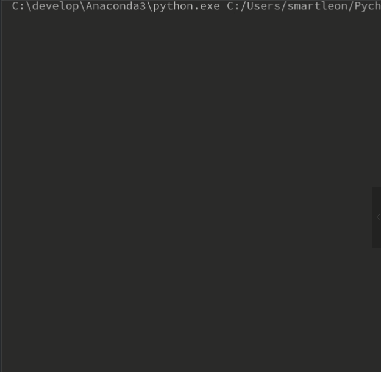
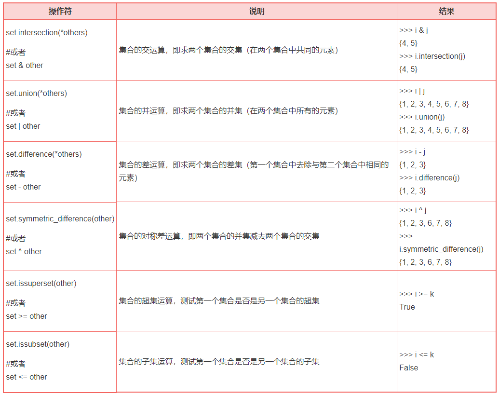
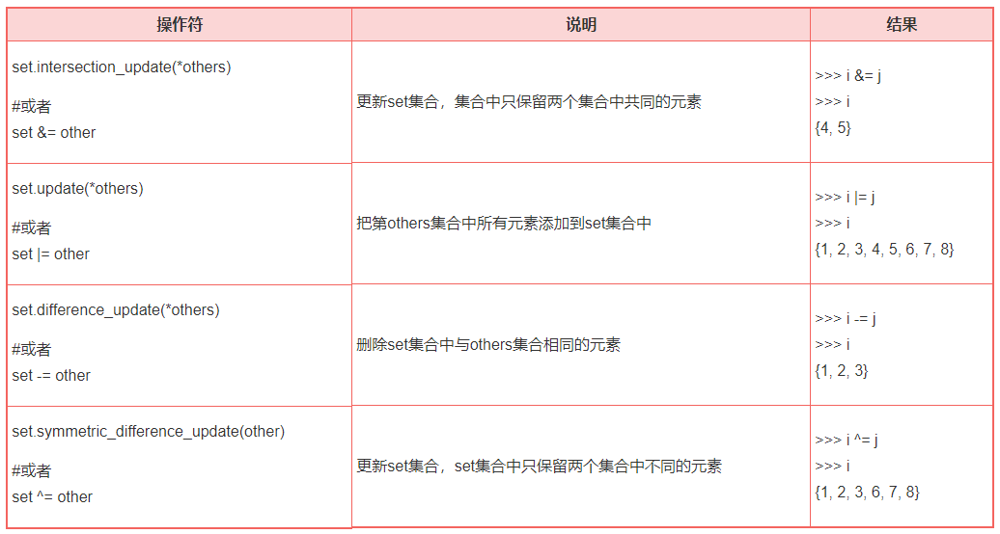

### 【python基础】-Task3-字典、集合、判断语句、三目表达式、循环语句
#### 1.dictionary字典
##### 1).概述

通过前面的学习，我们知道`list`「列表」是一个可变类型的容器「支持增、删、改、查」，并且里面可以存放任意类型的对象，那么字典「`dictionary`」也是一样，是一个可变类型的容器，可以存放个任意类型的对象，不过字典存的是键值对。

字典这个东西，非常形象，我们如果遇到一个不会的字，通常会去查字典，那么拼音「或部首」查字法，都是一一对应的，一个拼音对应一个字

在`python`中字典类似于`java`中的`hashmap`，`js`中的`json`

字典是`Python`语言中唯一的映射类型，映射类型对象里哈希值（键，key）和指向的对象（值，value）是一对多的的关系，通常被认为是可变的哈希表。

##### 2).格式

```
dic = {key1:value1,key2:value2,key3:value3,...}
```

使用一个`{}`来把字典包起来，键值之间使用`:`来分隔，每个键值对之间使用`,`来分隔。字典中`key`是唯一的，但是值可以不必唯一。

```python
# demo1:按照拼音查找字
dic = {"zhangsan":"张三","lisi":"李四","piaoliang":"漂亮"}
print(dic['zhangsan'])
print(dic['lisi'])
print(dic['piaoliang'])
```
输出结果：
```
张三
李四
漂亮
```
```python
# 修改字典中的 age
xiaoli = {"name":"xiaoli","age":22,"address":"中国陕西"}
print("小李错误的年龄：%d"%xiaoli["age"])
# 修改年龄
xiaoli["age"] = 23
print("小李的年龄修改为：%d"%xiaoli["age"])
```
输出结果：
```
小李错误的年龄：22
小李的年龄修改为：23
```

##### 3).字典的遍历

* 遍历`key`

```
格式：
dic = {"key1":"value1":"key2":"value2",...}
for key in dic.keys():
    print key
```

```python
# 遍历输出字典中的key值
TigerChain = {"name":"TigerChain","age":18,"address":"中国陕西","love":["看书","游泳","爬山"]}
for key in TigerChain.keys():
    print("TigerChain 字典中的key:%s"%key)
```

以上例子说明了字典中的数据可以是任意类型的

输出结果：

```
TigerChain 字典中的key:name
TigerChain 字典中的key:age
TigerChain 字典中的key:address
TigerChain 字典中的key:love
```

* 遍历`values`

```
格式:
dic = {"key1":"value1":"key2":"value2",...}
for value in dic.values():
    print value
```

```python
# 遍历字典中的 所有的 values
dict = {"name":"zhangsan","age":18,"height":"165CM"}
print(dict)
for value in dict.values():
    print("dict 字典中的 value: %s"%value)
```

输出结果：
```
{'name': 'zhangsan', 'age': 18, 'height': '165CM'}
dict 字典中的 value: zhangsan
dict 字典中的 value: 18
dict 字典中的 value: 165CM
```

```python
# 修改字典中某个 key 所对应的值
dict = {"name":"zhangsan","age":18,"height":"165CM"}
print("修改之前的字典：%r"%dict)
dict["name"] = "junjun"
print("修改之后的字典：%r"%dict)
```

输出结果：

```
修改之前的字典：{'name': 'zhangsan', 'age': 18, 'height': '165CM'}
修改之后的字典：{'name': 'junjun', 'age': 18, 'height': '165CM'}
```

##### 4)字典内置方法

|方法|描述|
|---|---|
|`dict.clear()`|删除字典里所有的元素|
|`dict.copy()`|返回一个字典的浅拷贝|
|`dict.fromkeys(seq[,val]))`|创建一个新字典，以序列seq中元素做字典的键，val为字典所有键对应的初始值|
|`dict.get(key,default=None)`|返回指定键的值，如果值不在字典中返回`default`值|
|`dict.has_key(key)`|如果键在字典dict里返回`true`，否则返回`false`|
|`dict.items()`|以列表返回可遍历的(键,值)元组数组|
|`dict.keys()`|以列表返回一个字典所有的键|
|`dict.update(dict2)`|把字典dict2的键/值对更新到dict里|
|`dict.values()`|以列表返回字典中的所有值|
|`pop(key[,default])`|删除字典给定键key所对应的值，返回值为被删除的值。key值必须给出。否则，返回default值。|
|`popitem()`|随机返回并删除字典中的一对键和值。|

##### 5).DEMO
**一个比较综合的例子，模拟一个注册，登录，和查询的例子，当输入`r`时就是注册，输入`l`时就是登录，注册成功以后，可以看到存起来的用户名和密码「用户名和密码拿字典来存」其中姓名是键，密码是值。**

```python
# 定义一个空字典
dic = {}
# 登录或注册的标志
flag = 'r'
# 查询的标志
search = 'r'
# 注册的标志
register = 'r'
# 登录的标志
login = 'r'
# 退出的标志
exit = 'r'

while flag == 'r' or 'l':
    flag = input("注册或登录?r/l: ")
    # 注册
    if flag == 'r':
        prompt = "添加用户名:"
        uname = input(prompt)
        upass = input("添加密码：")
        dic[str(uname)] = str(upass)
        print("注册成功")

        search = input("是否要查询已注册的用户?s/e:")
        if(search=='s'):
            print(dic)
        else:
            continue
        # 登录
    elif flag == 'l':
         loginUname = input("输入用户名:")
         loginPass = input("输入密码：")
         for key in dic.keys():
             if(str(loginUname) == key and dic[key] == str(loginPass)):
                 print("欢迎 %s 登录"%key)
                 exit = 'q'
                 break
             else:
                 exit = 'e'
         if exit =='e':
             print("用户名或密码错误")
        #  登录成功退出
         elif exit=='q':
             break
    else:
        print("输入错误")
        break
```

结果展示：



#### 2.集合

set（集合）类型是Python3的一种数据类型，集合（set）中包含的元素是**无序的，无重复的序列**。集合数据类型的主要作用是测试是否是集合成员中的一个，和消除重复元素。

集合（set）是可变数据类型，支持插入和删除元素，但是不支持索引和分片元素。

##### Python3 定义集合
* 1）Python3的集合使用花括号{}定义，然后在花括号中把各个元素使用逗号,分开。Python3 集合中包含的元素可以是不同的数据类型（如包括字符串和整数），但通常情况下我们创建的集合的元素都是同一种数据类型。

```python
#定义集合中包含不同数据类型
s1 = {'Python3', 123, 321}
```

输出结果：

```
{'Python3', 123, 321}
```

```python
#集合的元素为相同数据类型，字符串
s2 = {'Python2', 'Python3'}
```

输出结果：

```
{'Python2', 'Python3'}
```

```python
#集合的元素为相同数据类型，整数
s3 = {123, 321, 234, 432}
```

输出结果：
```
{123, 321, 234, 432}
```

* 2）定义集合时，如果包含相同的数据元素，那么将去除重复的元素

```python
s = {123, 321, 123, 321}
```

输出结果：
```
{321, 123}
```

* 3）定义一个空集合，空集合使用set()函数定义，使用一对花括号{}定义的是一个字典（dictionary），

```python
st = set()
```

* 4）Python3 集合不支持嵌套定义。

##### Python3 测试元素是否存在

集合（set）的一个重要的功能就是测试集合中是否包含一个元素。

```python
basket = {'apple', 'orange', 'apple', 'pear', 'orange', 'banana'}
print(basket)                      # show that duplicates have been removed
{'orange', 'banana', 'pear', 'apple'}
'orange' in basket                 # fast membership testing
```

输出结果：
```
True
```

测试集合中不否包含特定的一个元素

```python
basket = {'apple', 'orange', 'apple', 'pear', 'orange', 'banana'}
print(basket)                      # show that duplicates have been removed
{'orange', 'banana', 'pear', 'apple'}
'crabgrass' not in basket            # fast membership testing
```

输出结果：

```
True
```

##### Python3 集合的添加删除操作

* Python3 向集合中添加元素

Python3向集合中添加元素的语法如下

```
set.add(elem)
```

实例如下：

```python
i = {1, 2, 3, 4, 5}
i.add(8)
```

输出结果：

```
{1, 2, 3, 4, 5, 8}
```

* Python3 删除集合中的一个元素

1）使用`remove(elem)`方法删除一个元素，如果元素不存在，则会抛出一个错误

```
set.remove(elem)
```

实例如下：

```
i = {1, 2, 3, 4, 5}
i.remove(5)
i
{1, 2, 3, 4}
i.remove(9)
Traceback (most recent call last):
  File "<stdin>", line 1, in <module>
KeyError: 9
```

2）使用`discard(elem)`方法删除一个元素，如果元素不存在，则不会抛出错误

```
set.discard(elem)
```

实例如下：

```python
i = {1, 2, 3, 4, 5}
i.discard(5)
i
{1, 2, 3, 4}
i.discard(9)
i
{1, 2, 3, 4}
```

3）使用`set.pop()`删除集合中的第一个元素，并返回元素的值

```
set.pop()
```

实例如下：

```python
i = {1, 2, 3, 4, 5}
i.pop()
1
```

##### Python3 集合的交并差运算

假设三个集合i = {1, 2, 3, 4, 5}，j = {4, 5, 6, 7, 8}，k={4, 5}



#####  Python3 集合的赋值运算

假设三个集合i = {1, 2, 3, 4, 5}，j = {4, 5, 6, 7, 8}，k={4, 5}



#### 3.判断语句

#### 4.三目表达式

#### 5.循环语句